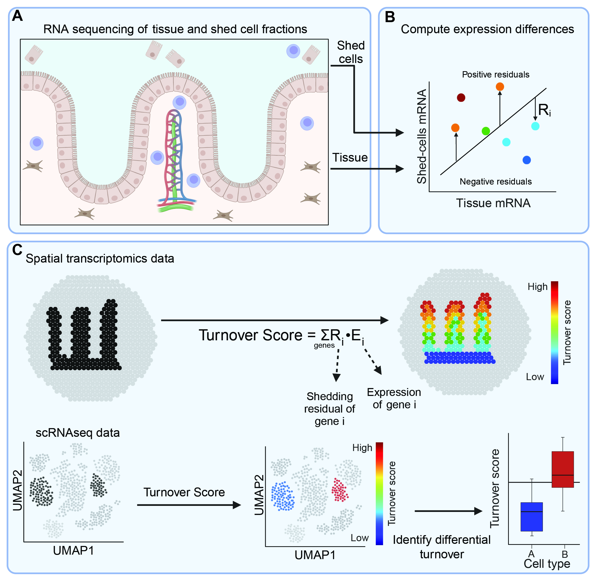

# Transcriptomic profiling of shed cells enables spatial mapping of cellular turnover in human organs

Welcome to the cellular turnover paper repository! Here you will find the notebooks related to the publication[1]. You can download all the scripts and thier associated data from Zenodo[2].



## Project Structure
### Main figures
#### Figure 2 - Turnover potential in the mouse small intestine.
- fig2/01-shedding_mouse.ipynb
#### Figure 3 - Turnover potential maps of the human upper GI tract.
- fig3/A02-shedding_busslinger.ipynb
#### Figure 4 - Turnover potential in the human colon. 
- fig4/03-scatter_on_image.ipynb
- fig4/04-knn_shedding_map.ipynb
#### Figure 5 - Expression signatures and microenvionment of colonocytes with high turnover score.
- fig4/01-analyze_olivera_short.ipynb
- fig4/01-hgca_shedding.ipynb
- fig4/03-scatter_on_image.ipynb

### Expanded View figures
#### Figure EV1 - Turnover scores of single cells from mouse small intestine.
- ev_apoptosis/compare_apoptotic_genes.ipynb
#### Figure EV2 - Reproducibility and marker stratificatino of NGT fluids
- fig3/A02-shedding_busslinger.ipynb
#### Figure EV3 - Spatial turnoverv maps of the human small intestine. 
- fig3/A03-analyze_harnik.ipynb
#### Figure EV4 - Luminal shedding is different from basolateral shedding. 
- ev_cfrna/compare_wash_and_blood.ipynb

## Getting Started
1. Download everything from Zenodo:
2. Create conda environment using the .yml file OR alternatively create from scratch
    ```bash
    conda create -n turnover_env python=3.10
    conda activate turnover_env
    pip install "spatialdata[extra]"
    pip install plotly adjusttext openpyxl igraph leidenalg dill
    ```
3. Run

## Usage

- Explore data and run analyses in directories relevant for each figure.

## To do
- Add links to this readme file(1,2).
- 

